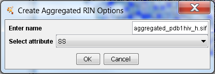
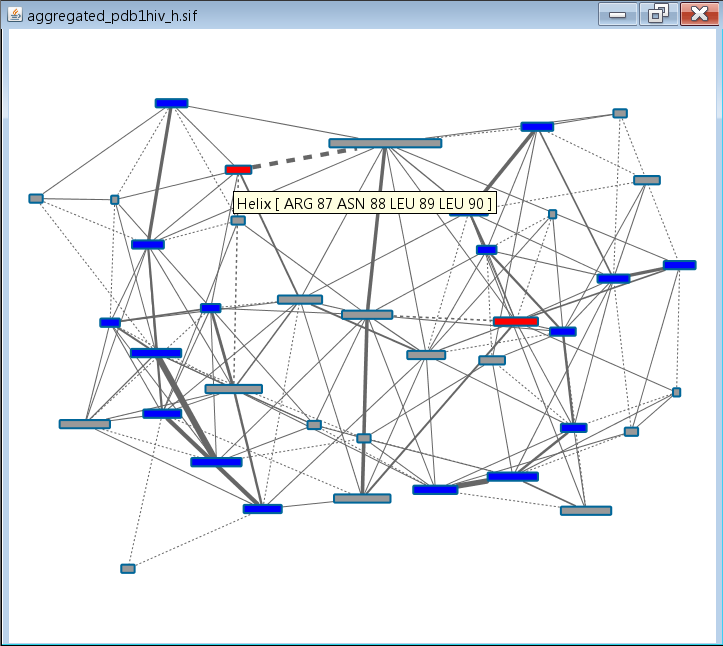

Aggregated RINs
---------------

RINalyzer supports the generation of aggregated RINs based on a node attribute selected by the user (Figure 1). In the resulting network, each node represents a group of consecutive residues with the same characteristic (attribute value), e.g, the same protein domain or secondary structure element. The node width is proportional to the number of residues in this group and the node tooltip shows the group characteristic (attribute value) and the included residues. The non-covalent interactions between residues in one group and residues in another group are represented by one solid edge line. The interactions between residues in two consecutive groups are shown as a dashed edge line. The edge width is proportional to the number of interactions.

**Figure 1:** Options for creating aggregated networks

An exemplary secondary structure network for the protein with PDB identifier 1hiv is shown in Figure 2. It consists of 39 secondary structure elements and they are connected by 151 interaction edges. The nodes are colored in red for helices, blue for sheets, and gray for loops (the same colors as defined in the RINalyzer Visual Properties). The node tooltip shows the type of node (Helix, Sheet or Loop) and the residues in this group. The edge thickness, which is proportional to the number of interactions, indicates which secondary structure elements are closer to each other in the 3D protein structure and thus contain more residues that interact directly, e.g., the beta sheets.

**Figure 2:** Example for an aggregated network from secondary structure elements
