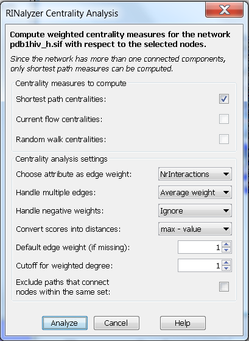
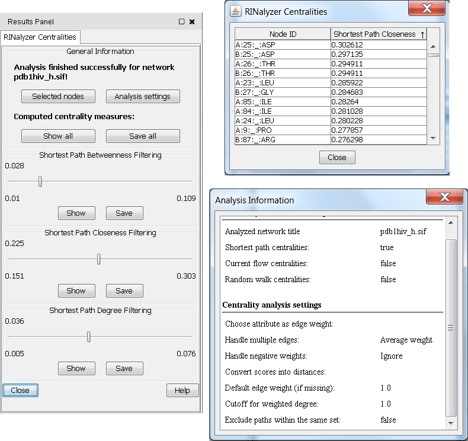

Centrality Analysis
-------------------

One of the key features of RINalyzer is the ability to compute weighted centrality measures with respect to a set of selected nodes, a node set. The following centrality measures can be calculated: weighted degree; shortest path closeness and betweenness; current flow closeness and betweenness; random walk closeness and betweenness. As the centrality analysis of larger networks is computationally intensive, the measures can be computed independently.

For computing centrality measures, we assume that the network is **undirected, connected**, and has **no loops** (no self-interacting nodes). The network can be **unweighted** or **weighted,** and may have **multiple edges**.

* * *

### Centrality Analysis Settings

In weighted networks, the weights have to be non-negative values. We always assume that RINs have edge weights that are proportional to the strength of the represented residue interaction. Thus, for shortest path computation, the weights have to be converted to distance scores such that smaller values are assigned to edges that connect nodes with stronger interactions. Self-loops are ignored by the centrality calculation.

**Figure 1:** RINalyzer Centrality Analysis dialog

The following analysis settings can be customized:

* **Choose attribute as edge weight:**  
This setting is used to assign weights to the edges of the network to be analyzed by selecting a numeric edge attribute from the edge attributes stored in the current Cytoscape session. Edge attributes can be easily created through the Cytoscape GUI or imported from an edge attribute file (see Section [Attribute files](rins_spec.php#attribute_files) for file format specifications). The default option for the weight attribute is *None* and stands for no specific attribute, i.e., all edges are assigned the default edge weight. Note that edges with weight equal to zero will be ignored during the computation and missing weight values are replaced by the default weight.
  
* **Handle multiple edges:**  
RINs can have multiple edges that represent different interactions between residues such as hydrogen bonds or interatomic contacts. Since the computation of centrality measures is based on a single edge type, either a specific edge type has to be selected or the weights of multiple edges between directly connected nodes have to be merged into a single combined weight. One of the four alternatives can be chosen for merging weights: the maximum, the minimum, the average or the sum of the weights of the multiple edges between directly connected nodes.
  
* **Handle negative weights:**  
Since the computed centrality measures in RINalyzer are defined only for non-negative weights, negative edge weights have to be removed before computation. This can be done either by ignoring them (option *Ignore*) or by reverting them to their absolute value (option *Revert*).
  
* **Convert scores into distances:**  
Shortest path centrality measures are computed with the assumption that weights represent distances, i.e., the smaller the weight, the stronger the interaction. Therefore, if the assigned weights are generated by a similarity function, i.e., stronger interactions are indicated by larger weight values, it is necessary to convert them into distances. The first option is to invert each weight value (*1/value*), and the second is subtracting each value from the highest weight value (*max*) found in the network (*max - value*). Note that edge weights equal to zero cannot be inverted and will be ignored in the subsequent analysis. The *max* value is the highest value of the edge weights. We increase *max* by one before subtraction to avoid weights equal to zero.
  
* **Default edge weight (if missing):**  
When there are missing weight attribute values, they are replaced by this default value. For example, if the option *None* is selected instead of an edge attribute, the default weight is assigned to all edges. If the default weight is one, the network is treated as unweighted.
  
* **Cutoff for weighted degree:**  
Weighted degree counts the neighbors that are within the given distance cutoff from the node of interest. Note that this cutoff should be chosen in agreement with the specified edge weights.
  
* **For betweenness computation exclude paths between nodes within the same set(s)**  
This option can be changed when the subnetwork formed by the currently selected nodes is disconnected. In this case, the user may want to compute the betweenness values with respect to only a subset of node pairs that are connected by paths containing intermediate unselected nodes. RINalyzer checks whether the subnetwork defined by the selected nodes is disconnected by computing the number of its connected components.

  

* * *

### Description of the Centrality Measures

RINalyzer computes each centrality measure for all network nodes with respect to a set of selected nodes. We will refer to the current set of selected nodes as *root set*. The centrality measures can be divided into three main categories according to the type of paths they use for measuring the distance between two nodes:

* **Shortest path centralities:** The distance between two nodes is the length of the shortest path between them.
	* Weighted degree of a node counts its neighbors that are contained in the *root set* and are within a given distance cutoff from the node of interest.
	* Shortest path closeness of a node is the inverted average distance from this node to all nodes in the *root set*.
	* Shortest path betweenness measures the fraction of shortest paths between pairs of *root set* nodes that pass through the node of interest.

  
* **Current flow centralities:** The distance between two nodes is the effective electric resistance between them, that is, the difference of their potentials required for generating one unit of electrical current between them.    
	* Current flow closeness is the inverted sum of the effective resistances between the node of interest and all nodes in the *root set*.
	* Current flow betweenness measures the amount of current that passes through a node, when shipped from a source to a target node, over all source-target node pairs in the *root set*.
    
      
    
* **Random walk centralities:** The distance between two nodes is defined as the hitting time, i.e., the expected number of steps needed to reach a target node.
	* Random walk closeness is the mean hitting time over all random walks starting at the node of interest and ending at a node from the *root set*.
	* Random walk betweenness measures the expected number of visits to a node of interest by a random walk between each pair of *root set* nodes.

Degree and closeness are normalized by the number of selected nodes, and betweenness by the number of pairs of *root set* nodes. The formal definitions of the described measures can be found in the book "Network Analysis" by Brandes and Erlebach (2005). Note that current flow and random walk centrality measures can be computed only for connected networks.

  

* * *

### Results Presentation

After a successful computation, the `RINalyzer Centralities` panel appears as a new tab in the Cytoscape's Results Panel. It usually consists of at least three different panels, the first one contains general analysis information, and each consequent panel provides access to the values of a centrality measure. The `General Information` panel keeps track of the analyzed network, the set of selected nodes, and the analysis settings chosen for the current analysis run. The values of all computed centrality measures can be saved or visualized in a table by using the two buttons in this panel. For each computed centrality measure, RINalyzer offers three possible ways to examine the results:
* **Save** the centrality values **into a file**. The user can choose to save a specific centrality measure (*Save* button of the corresponding measure) or all measure at once (*Save All* button at the bottom of the dialog) into a *centstats* file. The format specifications are described in Section [Centrality Results File](file*types.php#results_spec).
* **Show** the centrality values **in a table**, which can be sorted by column. The table can display either only one measure or all measures at once. The first column displays the node identifiers, and the consecutive columns list the centrality values. 
* **Use a selection filter** that selects nodes with centrality values in a specified numerical range. The selection range can be defined by moving the slider or by double-clicking on the slider and entering the desired range values. The minimal and maximal possible values are shown above the slider, and the current range values below the slider. An example is shown in Figure 2.

Additionally, all centrality values are stored as node attributes. Thus, they can be further accessed and used in Cytoscape, e.g., for mapping node size or color to the values of a centrality measure.

**Figure 2:** Example for results presentation of network centrality analysis

