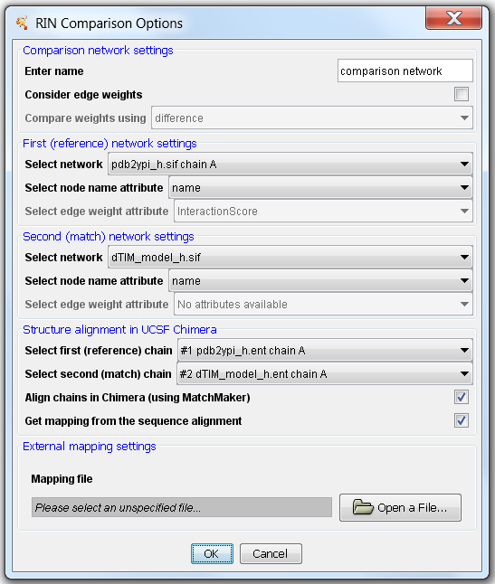
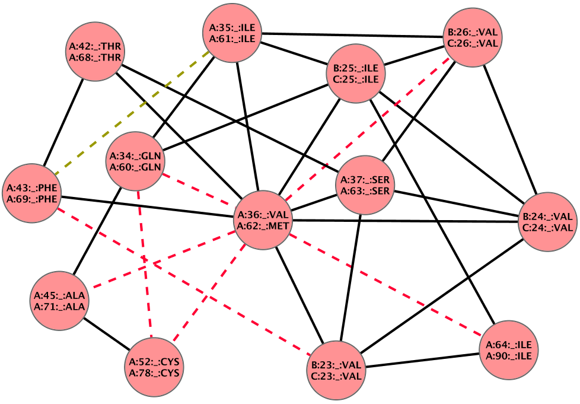

Comparison of RINs
------------------

RINalyzer offers the functionality to compare two RINs by creating a new comparison network, in which edges and nodes belonging to either or both networks are highlighted. The comparison is performed based on a structure or sequence alignment of the corresponding 3D protein structures. In addition, if the edges of the two networks are weighted, these weights can also be compared and saved in the new comparison network.

The comparison can be performed using one of the following options:
*   Alignment in UCSF Chimera: If the protein structures associated with the RINs to be compared are open in UCSF Chimera, the user can choose to align them in UCSF Chimera using the [MatchMaker tool](http://www.cgl.ucsf.edu/chimera/docs/ContributedSoftware/matchmaker/matchmaker.html) and use the resulting sequence alignment data to map the nodes in the comparison network.
*   XML structure alignment file generated using the [RCSB PDB Protein Comparison Tool](http://www.rcsb.org/pdb/workbench/workbench.do). It is the only possible option in RINalyzer 1.x versions.
*   Alignment FASTA (AFASTA) file as generated by UCSF Chimera for example. The header should be formatted as in this example: `>1PTA, chain A/36-362`.
*   Tab-separated file with two columns, the first corresponding to node names in the first network and the second to node names in the second network.
*   No file. In this case, the values in the node name attributes selected by the user are used for the mapping (recommended are name, RINalyzer identifier, or residue index).

Note that the node name attribute should contain [RINalyzer identifiers](rins_spec.md) and by default is set to either `name` or `RINalyzerResidue` for RINs generated by RINerator or Chimera, respectively.

For considering edge weights, an edge attribute containing the edge weights has to be specified for each network individually and the resulting edge weights are saved in an attribute called `CompWeight`. The weights are compared using one of the following options:
*   *difference:* subtracts the values in the second network edge attribute from the first.
*   *log ratio:* computes the logarithm of the ratio of the values in the first network edge attribute and the ones in the second network.
*   *ratio:* builds the ratio of the values in the first network edge attribute and the ones in the second network.

**Figure 1:** Settings dialog for RIN comparison

The result of a successful comparison is a new RIN, which contains three different types of edges: non-covalent residue interactions preserved in both structures (indicated by solid (black) lines), and interactions present only in one of the structures (presented by dashed (green) or dotted (red) lines). In this combined network, there are also three types of nodes: nodes belonging to both networks and representing successfully aligned residues (black node border), as well as nodes that cannot be aligned, i.e., are contained only in one of the two networks/structures (green or red). The type of each node and edge is stored as an attribute called `BelongsTo`, and can have one of the three values: *net1*, *net2*, and *net1,net2* or *both* for version 2.x and 1.x, respectively. *net1* always refers to the first (reference) network selected in the comparison, i.e., the first structure used in the alignment.

Several additional node attributes are created for the comparison network. They include:
*   `pdbFileName`: list of the residue identifiers for association with structures in UCSF Chimera
*   `OriginalNet1` and `OriginalNet2`: the original node identifiers
*   `EdgeFracNet1`: the fraction of adjacent edges belonging to *net1*
*   `EdgeFracNet2`: the fraction of adjacent edges belonging to *net2*
*   `EdgeFracBoth`: the fraction of adjacent edges belonging to *net1,net2*
*   `Substitution`: a short identifier for the substitution at this position if there is one
*   `Blosum62SubstScore`: the amino acid substitution score from the BLOSUM62 matrix if there is one

**Figure 2:** Example for a combined network representing the comparison of two RINs

In Cytoscape 3.x, RINalyzer provides two visual styles for the comparison networks: `Comparison style` and `Comparison style RIN`. In both styles, the node borders are colored in green, red or black if they belong to the first network, second network or both, respectively. The three new edge types are represented using different edge line styles: dashed lines for *net1* edges, dotted lines for *net2* edges, and solid lines for edges preserved in *both* networks. In the `Comparison style`, the edges are also colored in green, red or black depending on which network they belong to, while in the `Comparison style RIN` they are colored according to their interaction type, e.g., contacts in blue, hydrogen bonds in red, overlaps in gray, and combined edges in black.

In Cytoscape 2.7, the three new edge types are represented using different edge line styles: dashed lines for *net1* edges, dotted lines for *net2* edges, and solid lines for edges preserved in *both* networks.

As Cytoscape 2.6.x provides only two types of edge lines, it is difficult to represent the three new edge types in the combined RIN. Our solution to this problem involves using the RINalyzer's Visual Properties dialog and the Cytoscape's VizMapper. First, all edge types that are not relevant for the comparison, i.e., all except combi:all_all, are hidden (using the Visual Properties dialog for edges). Then, the edge color is mapped to the attribute BelongsTo in the VizMapper. The result can be seen in Figure 2, where interactions represented by black solid lines belong to *both* networks, by green dashed lines only to *net 1*, and by red dashed lines to *net 2*. The label of each node is composed of the node labels of the aligned pairs of residues.

