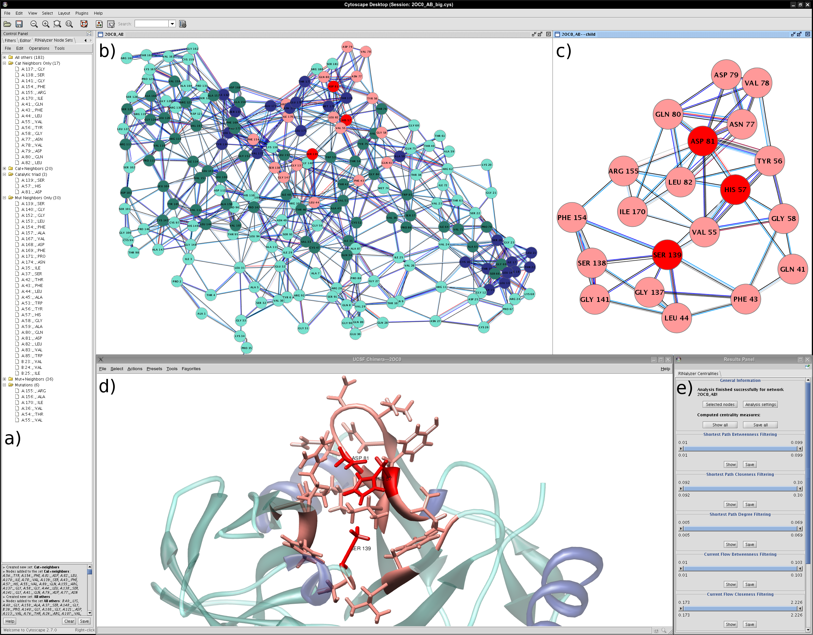
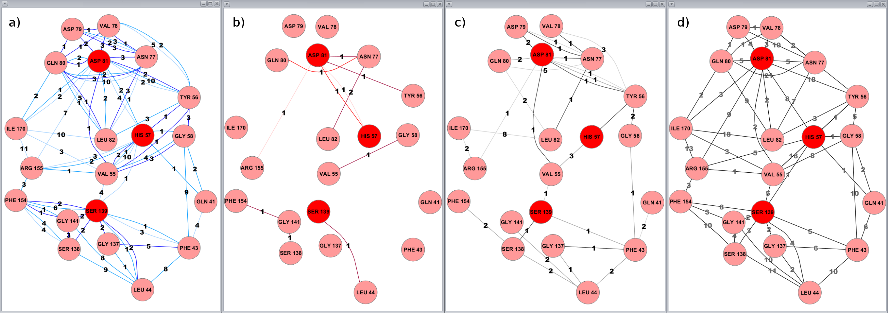
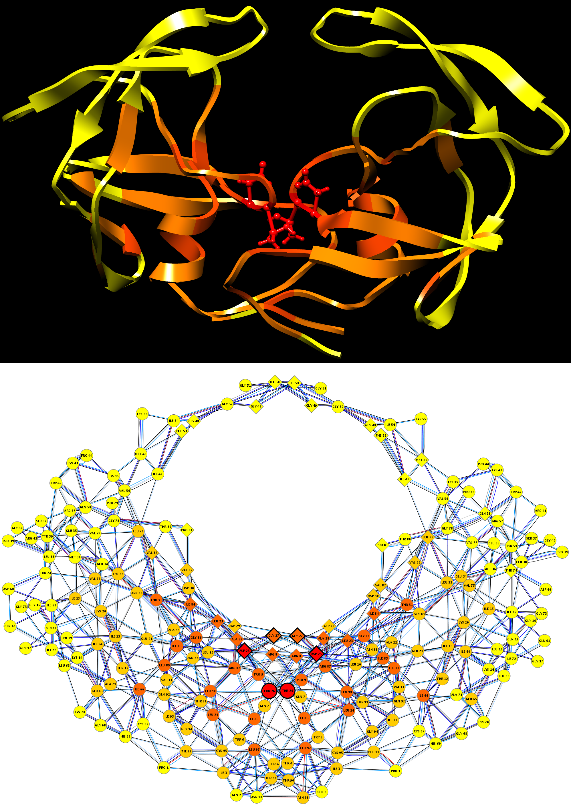
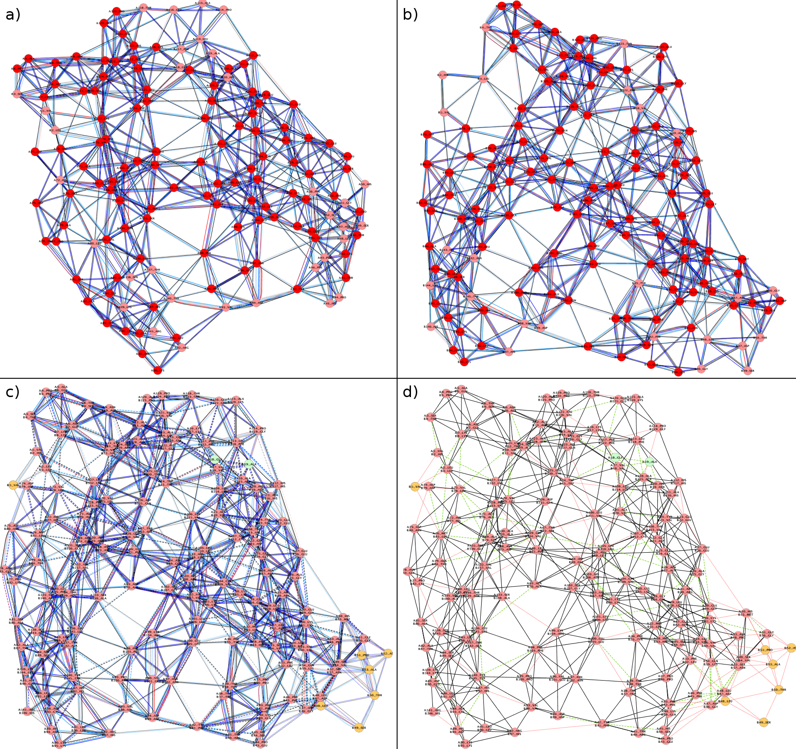

Gallery
=======

**Example 1:** Visual analysis of the NS3-4A protease of the hepatitis C virus and the corresponding residue interaction network (click on the image to enlarge it)

1.  RINalyzer node set interface
2.  RIN representing the NS3-4A protease [^1],[^2]
3.  RIN of the catalytic protease site [^1],[^2]
4.  3D molecular structure visualized by UCSF Chimera (PDB identifier 2OC0) [^1]
5.  RINalyzer centralities panel

[^1]: Catalytic site residues/nodes are in red, their interacting residues/nodes in pink, and all other residues/nodes are colored according to secondary structure (dark blue for helices, dark green for strands).  
[^2]: Non-covalent residue interactions have different colors, that is, interatomic contacts in blue, hydrogen bonds in red, overlaps in gray.

  

* * *

**Example 2:** Illustration of the non-covalent residue interactions in the catalytic site of the hepatitis C virus NS3-4A protease of the hepatitis C virus (click on the image to enlarge it)

1.  interatomic contacts
2.  hydrogen bonds
3.  van der Waals overlaps
4.  generic residue interactions

Edges are labeled with the number of interactions of the corresponding type.

  

* * *

**Example 3:** Centrality analysis of the RIN derived from a wild-type HIV-1 protease structure (PDB identifier 3PHV) (click on the image to enlarge it)

Unweighted shortest path closeness is computed for each node in the network, and the centrality values are converted to standard scores (Z-scores). Both the HIV-1 protease residues and the corresponding network nodes are colored according to the shortest path closeness Z-scores:

1.  red for values above 2
2.  dark orange for values between 2 and 1
3.  light orange for values between 1 and 0
4.  yellow for all other values

Catalytic residues are shown as balls and sticks in the molecular view, and highlighted by thicker node lines in the network view. Residues interacting with a bound substrate (PDB identifier 1KJF) are represented by diamond-shaped nodes in the RIN of the HIV-1 protease.

  

* * *

**Example 4:** RIN comparison of the alpha and beta chain of Deoxyhemoglobin based on [an alignment](http://www.rcsb.org/pdb/workbench/showPrecalcAlignment.do?action=pw_fatcat&pdb1=4HHB&chain1=A&pdb2=4HHB&chain2=B) of the corresponding 3D protein structures (click on the image to enlarge it)

1.  RIN representing the alpha chain (PDB identifier 4HHB) [^1]
2.  RIN representing the beta chain (PDB identifier 4HHB) [^1]
3.  Combined RIN with different types of non-covalent interactions [^2],[^3],[^4]
4.  Combined RIN with generic residue interactions [^3],[^5]

[^1]: Nodes colored according to secondary structure (red for helices, blue for strands).  
[^2]: Nodes present only in the alpha chain are green, nodes present only in the beta chain are orange, and all other nodes are pink.  
[^3]: Solid edge lines represent non-covalent residue interactions preserved in both structures; dashed interactions are present only in the alpha chain and dotted interactions only in the beta chain.  
[^4]: Edges are colored according to interaction type (interatomic contacts in blue, hydrogen bonds in red, overlaps in gray).  
[^5]: Interactions between residues only in the alpha chain are green, interactions only in the beta chain are red, and all other interaction edges are black.  

