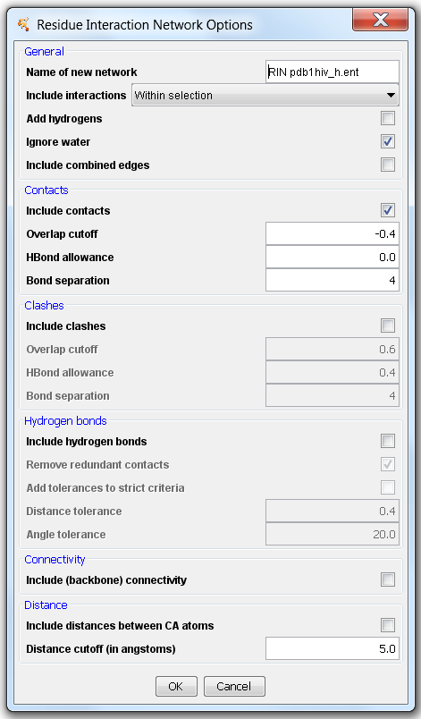

RIN Import
----------

Starting with version 2.x, RINalyzer includes the feature to directly import a RIN from our [RINdata](http://rinalyzer.de/rindata.md) web service (Figure 1). The user only needs to specify the PDB identifier and the path to the UCSF Chimera executable (if it is used for the first time and not installed in the default location). Then, the RIN data for the specified PDB identifier is retrieved and loaded into Cytoscape. Since the protein structure file cannot be saved in Cytoscape, it is saved for further use into `USER\_HOME/CytoscapeConfigureation/pdbs/` and if UCSF Chimera can be started, the structure is also opened.

After the RIN is loaded, the RIN Layout considering the 3D coordinates of the residues as well as the default RINalyzer visual style are applied to the network view, so that the nodes and edges are colored according to secondary structure and interaction subtype, respectively. Other residue attributes available in UCSF Chimera can automatically be transferred as node attributes in Cytoscape using the RINalyzer menu.

**Figure 1:** Dialog for importing RIN from RINdata web service

RINs generated using the RINerator package or the RING web service should be imported using the new `Import RIN from File` menu, in order to ensure correct association with the corresponding structure in UCSF Chimera. The import options are shown in Figure 2 and allow the user to select the RIN file, specify the delimiter (`\s` for space, `\t` for tab, etc.), and enter the PDB identifier or file name (in parentheses) that should be associated with this RIN. Entering the correct protein structure name is crucial for the automatic association of the nodes with the corresponding residues once the structure file is loaded into Chimera.

**Figure 2:** Options for importing RIN from file

* * *

RIN Generation
--------------

RINalyzer supports the generation of RINs from a selection of residues in UCSF Chimera by using the new version of structureViz. In the resulting RIN, nodes represent amino acid residues, solvent molecules, ligands, etc., and the edges correspond to (non-) covalent interactions between these entities. As can be seen in Figure 3, five types of edges can be created: contacts, clashes, hydrogen bonds, connectivity (backbone), Cα distances. The parameters for each interaction type are initially set to the default values provided by Chimera as described [here](http://www.cgl.ucsf.edu/chimera/docs/ContributedSoftware/findclash/findclash.html) for contacts/clashes, [here](http://www.cgl.ucsf.edu/chimera/docs/ContributedSoftware/findhbond/findhbond.html) for hydrogen bonds, and [here](http://www.cgl.ucsf.edu/chimera/docs/ContributedSoftware/addh/addh.html) for adding hydrogen atoms. There are different interaction subtypes depending on whether an interaction occurs between the atoms in the main chain (mc), side chain (sc), water, etc., and the number of such interactions is stored in the edge attribute `NumberInteractions`. For each interaction, the interacting atoms identifiers as well as the distance/overlap are also included as attributes. For contact edges this equals to the (minimum) distance between the closest atoms, for hydrogen bonds to the distance between the H donor and acceptor, for distance edges to the distance between the atoms, and for clashes to the (maximum) overlap between the atoms.

After a RIN is generated, the RIN Layout considering the 3D coordinates of the residues as well as the default RINalyzer visual style are applied to the network view, so that the nodes and edges are colored according to secondary structure and interaction subtype, respectively. In addition, all residue attributes available in UCSF Chimera are automatically transferred as node attributes in Cytoscape. Usually, they include secondary structure, hydrophobicity, residue coordinates, backbone and side chain angles, average bfactor, average occupancy and others.

**Figure 3:** Options for creating a RIN from a selection in UCSF Chimera
