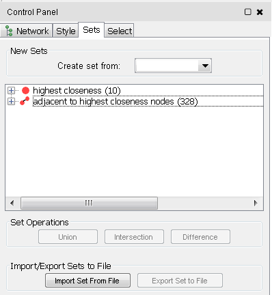
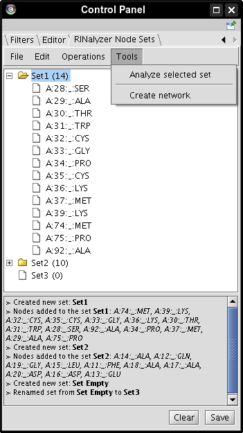

Node Sets
---------

Note that since version 2 of RINalyzer, the node sets functionality has been replaced by a new app called [setsApp](http://apps.cytoscape.org/apps/setsApp), which is available for download from the Cytoscape App Store. In addition to sets of nodes, it also supports various operations on sets of edges as can be seen in Figure 1. For more documentation, see [here](http://www.cgl.ucsf.edu/cytoscape/utilities3/setsApp.shtml).

**Figure 1:** setsApp interface

Different node sets can be created and saved using RINalyzer. A screenshot of the corresponding interface is shown in Figure 2. For example, a node set can contain only the nodes with very high centrality values or nodes that represent the functionally relevant residues of a protein binding site.

Note that each node set has to consist of nodes from a single network. A tool-tip shows the name of the network that contains the nodes in a set. If the set is empty, it has no network assigned to it and its tool-tip displays *No network*.

Since it is difficult to keep track of all operations performed with each node set, they are logged. The log is in HTML format and can be stored as an HTML file. The logged messages can be cleared at any time.

**Figure 2:** Interface for node sets

The *Manage Node Sets* interface provides different user operations, most of which are grouped into four menu items.

1.  `File`: for creating new sets, opening and saving them;
	*   **Create an empty set** with a set name of your choice.
	*   Select nodes in the network view and **create a set of the selected nodes**. If no nodes are selected, the created set is empty.
	*   **Create a set from a Boolean node attribute**. A network attribute can be loaded by importing a node attribute file into the Cytoscape session or created manually from the Cytoscape menus. This attribute should divide the nodes in two separate groups according to a property of interest.
	*   **Open** a node set file and load the node set(s) stored in it.
	*   **Save** one or more sets to a file. The file format is described in Section [Node Set File](file_types.md#nodeset_spec). Only sets that are selected can be saved.
2. `Edit`: for modifying sets (renaming, adding/deleting nodes/sets);
	*   Node sets can be **renamed** at any time. However, two sets cannot have the same name and if this is the case, a consecutive number is automatically appended to the set name.
	*   Select nodes in the network view and **add** these **nodes to a selected set**. If the set is not empty and the nodes to be added belong to another network than the nodes in the set, they are not added. The number of nodes in the set is displayed in parentheses following the set name.
	*   **Delete nodes** from a set. This option is valid only for selected nodes in a set and not for sets.
	*   **Delete** one or more **selected sets**.
3.  `Operations`: for typical set operations, such as union and intersection;
	*   Construct the **union** of exactly two selected sets proposed that their nodes belong to the same network.
	*   Construct the **intersection** of exactly two selected sets proposed that their nodes belong to the same network.
	*   Construct the **difference** of exactly two selected sets proposed that their nodes belong to the same network. Depending on the chosen menu option, the difference represents either the upper set minus the lower or vice versa.
	*   **Invert** a selected set. This operation creates a new set from all nodes in the current network except the nodes in the selected set. Note that the network to which the nodes in the set belong should also be selected.
4.  `Tools`: for analyzing sets and creating new networks from the set nodes;
	*   The **centrality analysis can be run** on a network with respect to a selected node set. Of course, the set should contain at least two nodes.
	*   **Extract a new network** from the network containing the nodes in a selected set. The new network consists of the nodes in the set and their adjacent edges.

Additional set operations as well as the most frequently used can be accessed from the context menu for node sets. For example, the **Select nodes** operation invokes the selection of all set nodes in the network view of the corresponding network. The menu **Visual Mapping Bypass** offers the functionality to set any visual node property to a new value for all nodes in the current set, e.g., change the color of all nodes in a set to a user-defined color or the node shape to a rectangle.
