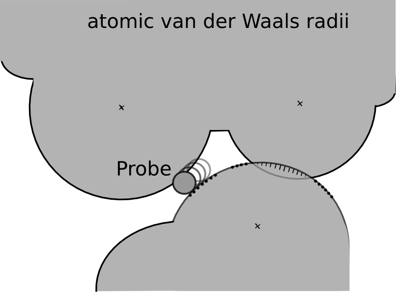
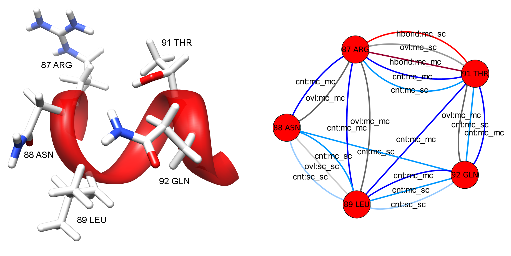

RIN Generation Method
---------------------

This method for RIN generation incorporates non-covalent interactions between main and side chains of amino acid residues as well as the strength of these interactions. RINs are generated from a PDB molecular structure file by performing the following steps:

1.  All hydrogens are added to the protein structure by the [Reduce](http://kinemage.biochem.duke.edu/software/reduce.php) program [^1].
2.  The non-covalent interactions are identified using the [Probe](http://kinemage.biochem.duke.edu/software/probe.php) program [^2].
3.  A residue interaction network is generated by the RINerator package.

Most of the protein structures (about 90 %) are determined by X-ray crystallography. Unfortunately, this technique is not capable of inferring the coordinates of hydrogen atoms, and they are thus not included in the PDB file of a protein structure. However, hydrogen atoms are crucial for identifying non-covalent interactions between amino acids. Therefore, the well-known program Reduce is used to add the hydrogen atoms to the PDB structure file using local geometry.

**Figure 1:** A diagram of the small-probe contact dot algorithm (after [^2]). The small, 0.25 Å radius, probe sphere rolls over the van der Waals surface of each atom, leaving a dot periodically wherever it also touches another atom that is not within three covalent bonds. Where atoms overlap, the unfavorable contact is emphasized by drawing spikes instead of dots [^2].

The resulting PDB structure file has explicit hydrogen atoms and serves as input for the program Probe. Probe identifies the contacts between amino acids in a protein by evaluating their atomic packing using small-probe contact dot surfaces. A small virtual probe (typically 0.25 Å) is rolled around the van der Waals surface of each atom and an interaction (contact dot) is detected if the probe touches another non-covalently bonded atom (see Figure 1). Overlapping van der Waals shells of non-polar atoms and hydrogen bonds are indicated by spikes, i.e., lines drawn from the dot position to the contact midplane, along the atom radius. The spike length is denoted by lsp and dots without spikes have length 0.

The contact dots and spikes can be used to quantitatively measure the molecular goodness-of-fit of the packing interactions. Hydrogen bonds and other overlaps are quantified by the volume of overlap. The contact scores are evaluated per dot, and are then summed for each atom pair. The non-overlapping van der Waals contacts are quantified by an error-function weighting, which awards close contacts a higher score than distant or significantly overlapping ones, but slight overlaps are still favorable in net effect. The combined score is a weighted sum of the weighted non-overlapping van der Waals contacts, the volume of hydrogen bonds and the volume of overlaps. The Probe program summarizes these scoring data for all parts of an entire structure and can output a file with information for every atom or residue.

**Figure 2:** Detail view of the 3D molecular structure of HIV-1 protease (PDB entry 1hiv) (left) and the corresponding RIN (right). The molecular structure is visualized with UCSF Chimera and the RIN with Cytoscape. In the RIN view, the multiple edges represent different interaction types and are colored and labeled accordingly.

The last step of the network generation method is accomplished by the Python package RINerator. It creates an undirected weighted network with multiple edges, as shown in Figure 2. The nodes represent the amino acid residues of the protein, whereas the links between them represent the non-covalent interactions identified by Probe. The edges are labeled with an interaction type and subtype. Possible types are interatomic contact (*cnt*), hydrogen bond (*hbond*), overlap (*ovl*), and combined (*combi*), while the subtypes indicate interactions between main chains (*mc*) and side chains (*sc*) of the amino acids. Each edge is weighted with the respective score for the interacting amino acid residues as computed by Probe, and the weight is proportional to the strength of the interaction. The resulting RINs are stored in a file format that can be loaded into Cytoscape. The file format specifications are described in detail [here](rins_spec.md).

  

* * *

[^1]: Word JM, Lovell SC, Richardson JS, Richardson DC (1999): *Asparagine and Glutamine: Using Hydrogen Atom Contacts in the Choice of Side-chain Amide Orientation*, J Mol Biol, Vol. 285(4):1735-47.

[^2]: Word JM, Lovell SC, LaBean TH, Taylor HC, Zalis ME, Presley BK, Richardson JS, Richardson DC (1999): *Visualizing and quantifying molecular goodness-of-fit: small-probe contact dots with explicit hydrogen atoms*, J Mol Biol, Vol. 285(4):1711-33.
