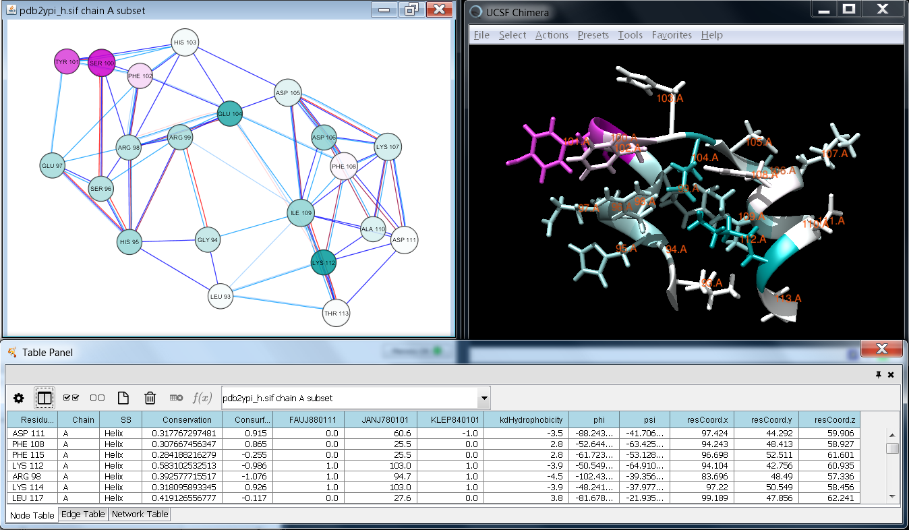

RINerator
=========

News
----

**December 2014**  
A new version of RINerator is released. In particular, it computes conservation scores from a user-specified multiple sequence alignment ([details](./cons_scores.md)), retrieves biochemical amino acid properties from external resources ([details](./install_rinerator.md#example4)), and generates RINs compatible with Cytoscape 3.x and RINalyzer 2.x ([details](./rindata_gen.md)).

* * *

Description
-----------

RINerator generates user-defined RINs from a 3D protein structure and enriches them with additional biochemical information. In contrast to previous simplistic interaction definition approaches based on spatial atomic distance between residues, RINerator enables a more realistic representation by considering different biochemical interaction types, such as hydrogen bonds and interactomic contacts, and even quantifying the strength of individual interactions. Furthermore, RINerator can calculate [conservation scores](./cons_scores.md) from a user-specified multiple sequence alignment and retrieve biochemical amino acid properties from external resources, such as [AAindex](http://www.genome.jp/aaindex/) and [ConSurfDB](http://bental.tau.ac.il/new_ConSurfDB/). The resulting networks and accompanying data can be visualized in Cytoscape using the [RINalyzer](../README.md) and [structureViz](http://www.cgl.ucsf.edu/cytoscape/structureViz2/) apps.

Residue interaction network constructed for a selection of residues from the 3D structure of yeast TIM (PDB: 2YPI) and additional information annotated to the nodes. The network is visualized in Cytoscape using the structureViz and RINalyzer apps, while the structure is displayed by UCSF Chimera. The network nodes and the corresponding residues are colored according to their conservation score (turquoise-to-pink coloring indicates variable-to-conserved sites). The network edges represent non-covalent residue interactions (blue for contacts and red for hydrogen bonds).

* * *

Releases
--------

**December 2014**  
The latest version can be downloaded [here](../rinerator/RINerator_V0.5.1.tar.gz). Further instructions can be found [here](./install_rinerator.md).

June 2014  
The previous version can be downloaded [here](../rinerator/RINerator_V0.5.tar.gz). Further instructions can be found [here](./install_rinerator.md).

April 2010  
The first release of RINerator can be downloaded [here](../rinerator/RINerator_V0.3.4.tar.gz). If you have trouble installing and using RINerator, you can read further instructions [here](../rinerator/README.TXT).

The RINerator module is distributed under the [GNU General Public License](http://www.gnu.org/licenses/gpl.html).

* * *

Reference
---------

Doncheva, N.T., Klein, K., Domingues, F.S., Albrecht, M. (2011)  
**Analyzing and visualizing residue networks of protein structures.**  
*Trends in Biochemical Sciences*, **36**(4):179-182, [doi:10.1016/j.tibs.2011.01.002](http://dx.doi.org/doi:10.1016/j.tibs.2011.01.002).

* * *

Contributors
------------

Nadezhda T. Doncheva (1), Olga Voitenko (1), Francisco S. Domingues (1,2), Olga Kalinina(1), and Mario Albrecht (1,3,4,5)  

Affiliations as of 2014:
1. Max Planck Institute for Informatics, Saarbrücken, Germany  
2. Institute of Genetic Medicine, EURAC research, Bolzano, Italy  
3. University Medicine Greifswald, Greifswald, Germany  
4. Graz University of Technology, Graz, Austria  
5. BioTechMed-Graz, Graz, Austria  
