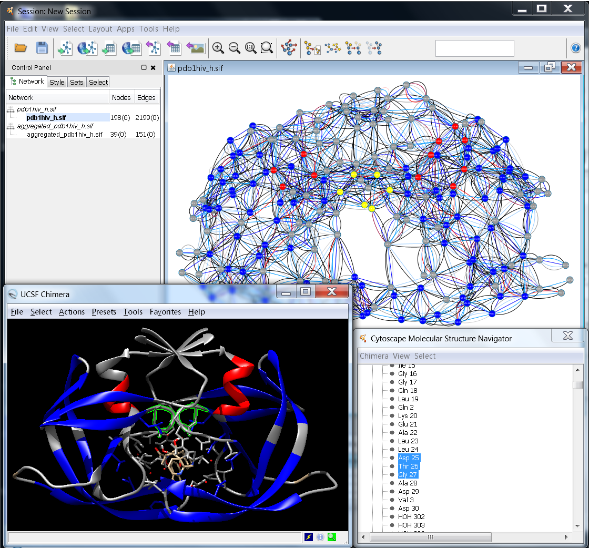
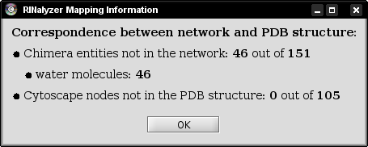

Interface to UCSF Chimera for Cytoscape 3.x
-------------------------------------------

One of the key features of RINalyzer is its ability to start UCSF Chimera and match the RIN shown in Cytoscape with its molecular structure viewed in UCSF Chimera (see Figure 1). Thus, the selection of residues in UCSF Chimera leads to the selection of the corresponding nodes in the RIN view and vice versa. The menus in RINalyzer 1.x and 2.x are organized slightly different. Another important change is that RINalyzer is not communicating directly with UCSF Chimera anymore, but it uses the structureViz app for this purpose. As a consequence, a new identifier needs to be assigned to each RIN node. This is done automatically by RINalyzer when importing a RIN from the RINdata webservice, from file or when creating a new RIN from UCSF Chimera.

**Figure 1:** Example for the interplay between Cytoscape and UCSF Chimera

In order to associate a node with a PDB structure, a protein chain, or a single amino acid residue, the correctly formatted information has to be contained in any of the string (list) attributes: "Structure", "pdb", "pdbFileName", "PDB ID", "structure", "biopax.xref.PDB", "pdb\_ids", "ModelName", "ModelNumber". The format is: \[modelName\[.modelNumber\]#\]\[residueID\]\[.chainID\], whereas modelName should be either 1) a 4-character PDB identifier; 2) a file path enclosed by quotation marks; or 3) an URL enclosed by quotation marks. Here are some examples for residue nodes:  
1hiv#25.A for residue 25 in chain A of the structure with PDB identifier 1hiv  
"pdb1hiv\_h.ent"#25.A for residue 25 in chain A of the structure contained in file pdb1hiv\_h.ent  
1abc.0#1.A for residue 1 in chain A in model 0 of the structure with PDB identifier 1abc  

For the RINalyzer tasks, a node attribute in the following format is needed: modelName:chainID:residueIndex:insertionCode:residueType, whereas missing values are substituted by an underscore (see the RIN specifications [here](rins_spec.php)). This attribute should be named either name or RINalyzerResidue.

A node can also be associated with a smiles structure, if it has a node attribute called "Smiles", "smiles", or "SMILES" containing the corresponding smiles string. In addition, structureViz checks for new associations, whenever a new network is created, the above listed node attributes are changed, or a new structure is opened in UCSF Chimera.

The following options related to protein structures in UCSF Chimera are provided by the RINalyzer version 2.x menus:
*   **Open Structure from File:**  
    This option should be used for local protein structure files. It launches UCSF Chimera if not already running and loads the file provided by the user into it. The association with currently open RINs is performed automatically in the background.  
*   **Open Protein Structure:**  
    Scans through the currently selected nodes to find all identifiers of protein structure and opens the ones selected by the user in UCSF Chimera. If no nodes are selected, RINalyzer would randomly select one assuming all nodes in the network belong to the same protein structure.
*   **Close Protein Structure:**  
    Scans through the currently selected nodes to find all identifiers of protein structure that are currently open in UCSF Chimera and closes the ones selected by the user. If no nodes are selected, RINalyzer would randomly select one assuming all nodes in the network belong to the same protein structure.  
*   **Create RIN from Chimera:**  
    RINalyzer supports the generation of RINs from a selection of residues in UCSF Chimera. More information is available [here](import.php).
*   **Annotate RIN from Chimera:**  
    This option retrieves all attributes associated with residues in UCSF Chimera and allows the user to select a subset or all of them to be saved as node attributes in the current RIN. In particular, these include secondary structure, residue coordinates, hydrophobicity, solvent accessible surface area (if already computed in UCSF Chimera), occupancy, etc. See also the [structureViz app webpage](http://www.cgl.ucsf.edu/cytoscape/structureViz2/) for more details.
*   **Sync Colors with Chimera:**  
    The color synchronization between network and structure views works in both directions. The Apply colors from associated Chimera models to current network view option will get the (ribbon) colors of all residues in the structure associated with the current RIN and save them as node colors in the current view and visual style. The Apply colors from current network view to associated Chimera models option will transfer the colors of the nodes in the current view to the residues they are associated with in the structure open in UCSF Chimera. To transfer the colors of the residues in only one model to the corresponding network nodes, select the model in the Molecular Structure Navigator dialog and go to Chimera -> Color synchronization
*   **RIN Layout:**  
    This layout is specifically implemented for RINs and can be found in the Layout menu of Cytoscape. It automatically retrieves the current 3D coordinates for residues associated with the nodes in the current network view and uses their projection on a 2D plane as a starting point for a distance-based stress minimization layout.

Some additional options are provided by the structureViz menu and Molecular Structure Navigator Dialog (see more documentation [here](http://www.rbvi.ucsf.edu/cytoscape/structureViz2/)), which is opened automatically with the start of UCSF Chimera. In particular, they include launching and exiting Chimera as well as adjusting the Settings for the Chimera path and the attributes that contain the identifiers.

* * *

Interface to UCSF Chimera for Cytoscape 2.x
-------------------------------------------

The following options are provided by the RINalyzer version 1.x menu _Protein Structure_:

*   **Open structure from file** opens a dialog showing the files on the local file system. This allows loading the PDB file that contains the structure, from which the RIN has been created. In this way, the best matching between the RIN nodes and the residues of the structure can be achieved. The selected PDB file is loaded in Chimera and the protein structure is linked to the currently selected network in Cytoscape.
*   **Open structure by PDB identifier** lists PDB identifiers extracted from the names of the currently opened networks in Cytoscape. RINalyzer can extract the PDB identifier from the network name if the name specifications for RINs are fulfilled (see Section [RIN Specification](rins_spec.php#rins_ff)). If a PDB identifier is selected from the list, the structure with this identifier will be downloaded from the PDB web server and opened by Chimera. The structure is then linked to the currently selected network in Cytoscape.
*   **Close structures** lists the names of the structures currently loaded in Chimera and allows closing any of them or all at once.
*   **Show/Hide backbone** menu is responsible for displaying the protein backbone in both the 2D network and in the 3D view. In the RIN, backbone edges are created for each pair of nodes with consecutive identifiers. In the 3D view, the protein ribbon is visualized using the build-in Chimera methods.
*   **Sync 3D view colors** option uses the colors of the network nodes to color the corresponding residues in the 3D view.
*   **Exit Chimera** closes the Chimera application.

Each time a macromolecular structure is loaded into Chimera, an information dialog indicates the quality of mapping between the currently selected network and the protein structure. To this end, RINalyzer checks if all residues are mapped to all nodes and vice versa. For a successful mapping, the node names have to agree with the specifications for RINs defined in Section [Node Names and Edge Types](rins_spec.php#nodes_edges). A typical mapping statistics is shown in Figure 2.

**Figure 2:** Mapping information

In most cases, the PDB structure file contains not only the amino acid residues, but water molecules and interacting ligand molecules or DNA. Since the nodes in a RIN are the amino acid residues of the protein, the water molecules are not presented in the RIN and cannot be mapped. If the RIN is generated only for the protein and not for the ligand it binds, then the ligand cannot be mapped either. Often, the RIN represents only one chain of a protein, while the PDB structure file contains all chains. In such cases, only the respective chain is mapped and all other chains are listed as amino acids that are not present in the network.
