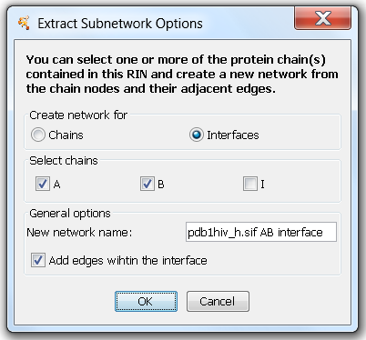

Extract Subnetworks
-------------------

RINalyzer provides the functionality to extract single chain(s) or interface(s) between chains in the same RIN (Figure 1). When generating a new RIN from a single or multiple chains, RINalyzer includes the interactions between residues in the specified chain(s) as well as on the interface between them. For the interface of one chain, all residues are included in the RIN that have interactions with other chains. For the interface between multiple chains, all residues having interactions with residues in other chains as well as their interactions are included in the RIN. In this case, the user can select whether or not interactions between residues in the same chain should be considered. The new networks belong to the same network collection and inherit the same attributes as the parent network.

**Figure 1:** Options for extracting subnetworks
