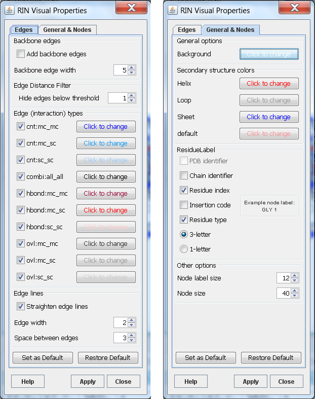

Visual Properties
-----------------

The *Visual Properties* menu option allows changing the appearance of a RIN by mapping some node or edge attributes to visual properties of the network. The properties are arranged in two main groups: general and node properties, and edge properties (see Figure 1). Each screenshot shows one of the tabs of the *Visual Properties* dialog. The visual properties in the dialog always refer to the currently selected network view. When the dialog is opened for the first time for a certain network, it displays the default values. They can be applied to the network view by clicking the *Apply* button. Any property can be easily changed to have a different value. If the visual properties have already been applied to the network view and the dialog is opened again, it displays the specified values for this network view. Furthermore, if the dialog is opened and the network view is switched, the dialog is updated to display the visual properties of the switched network.

As an example, let us assume that two networks *A* and *B* are opened and the default visual properties are applied to both networks. Then, network *A* is selected to be in focus. The *Visual Properties* dialog is opened again and the node size is changed from the default value 40 to 50. After these new properties are applied to network *A*, its nodes become larger. Now, if network *B* is selected, while the *Visual Properties* dialog is still open, the node size will change to the default value, because in network *B* the node size is still 40.

We provide default properties for the colors and the sizes. These are displayed the first time the dialog is opened for a network view. These properties can be changed any time and the default properties can be restored by clicking the *Restore Default* button. If the default properties are not appropriate for the networks of interest, new default values can be defined and saved by clicking on the *Set as Default* button. Then, each time the dialog is opened for the first time, the properties will have the newly defined values.

The default properties are stored in a `props` file (for more details see Section [Visual Properties File](file_types.md#visprops_spec)). The original `rinalyzer.props` file is included in the RINalyzer executable. However, once a new set of properties is saved by using the *Set as Default* button, a new `rinalyzer.props` file is created in the `.cytoscape` directory and this file is used by the plugin for loading the default properties.

**Figure 1:** Visual properties for RINs

Up to now, the following visual properties can be adjusted:

*   **Background color**  
    The background color should have a high contrast to the colors of the nodes and edges.
  
*   **Node colors**  
    RINalyzer can color the nodes according to the secondary structure of the represented residues. This option is very useful for the visual analysis of RINs. The secondary structure information can be loaded into the Cytoscape session either by importing a node attribute file or by opening the protein structure file of the RIN in Chimera through the RINalyzer menu. The node attribute file should contain the attribute name *SS* (for secondary structure). The attribute values have to be strings: *Sheet* or the letter *S* or *E* for sheet, *Helix* or the letter *H* for helix, *Loop* or the letter *L* or *C* for loop, and an empty string, the minus symbol or the letter *U* for unknown secondary structure. When the protein structure is loaded with UCSF Chimera, RINalyzer automatically stores the secondary structure as a node attribute. The colors for the secondary structure elements can be changed by the user.
  
*   **Node label display**  
    The RIN node label consists of the PDB identifier, chain identifier, residue index, insertion code, and residue type. If one of these elements is missing, it is replaced by an underscore (see [RIN Specification](rins_spec.md)). Therefore, the full node label is rather long and it might be inappropriate for visualization. Thus, one can select from the label elements listed above to compose the node label style in a different fashion. An example is shown in Figure 1. In addition, the size of nodes and the font of their labels can be customized.
  
*   **Backbone edges**  
    This option shows the backbone edges in the network. They are defined as the edges connecting two residues with successive residue numbers and have the interaction type *backbone*.
  
*   **Visibility of edges**  
    In most cases, RINs have multiple edges that represent different interaction types. The high number of multiple edges may lead to an unclear view of the RIN in Cytoscape. Thus, for all interaction types, the edges of the same interaction type can be shown/hidden by selecting/deselecting the respective check box.
  
*   **Edge colors**  
    The edges can be colored with respect to the interaction type, whereby the colors can be easily changed.
  
*   **Edge line type and width**  
    For improved visualization of multiple edges, these can be drawn as straight, parallel lines that lie close to each other. The appearance of the lines is determined by the width of the edge lines and the space in-between.
  
*   **Edge Distance Filter**  
    This option allows hiding edges between residues closer in sequence than the specified threshold.

Any other property can be changed using the Cytoscape [Visual Styles](http://wiki.cytoscape.org/Cytoscape_3/UserManual#Styles) in 3.x or the [VizMapper](http://cytoscape.org/manual/Cytoscape2_7Manual.html#Visual%20Styles) in 2.x.
